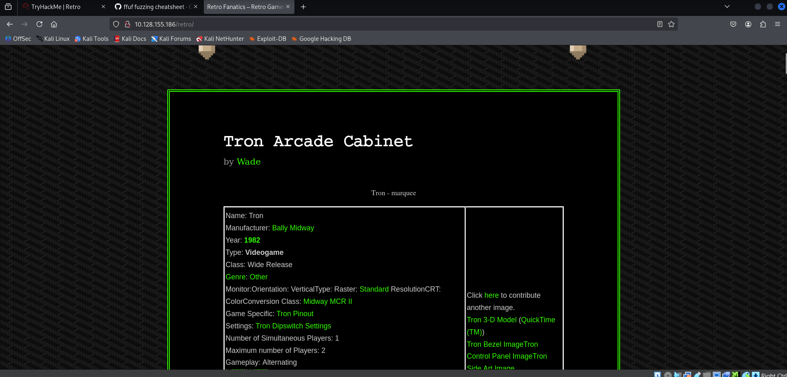
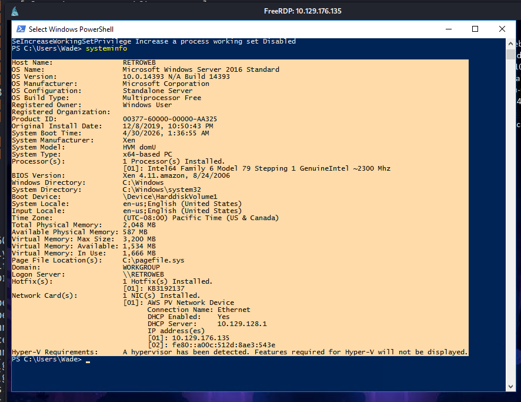
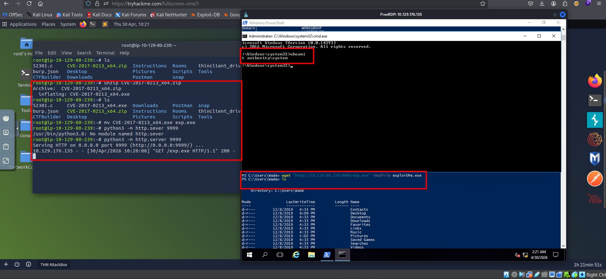

# [TryHackMe:Retro](https://tryhackme.com/room/retro)

## Enumeration
First I'll do Nmap scan to discover open ports

```bash
sudo nmap -p- -T4 -Pn 10.128.155.186 -oN simplePort.txt
```
 *result*
```
PORT     STATE SERVICE
80/tcp   open  http
3389/tcp open  ms-wbt-server
```
There is two open ports one is for RDP and second is Windows server. fuzzing directories for windows server.
```bash
 ffuf -w /usr/share/wordlists/dirbuster/directory-list-2.3-medium.txt:FUZZ -u "http://10.128.155.186/FUZZ" -fc 404,500 -v
```
Found this directory page with name retro.
```
[Status: 301, Size: 151, Words: 9, Lines: 2, Duration: 475ms]
| URL | http://10.128.155.186/retro
| --> | http://10.128.155.186/retro/
    * FUZZ: retro
```



Exploring website we will find somewhere Wade user left comment have password inside it.

then based on RDP open service we can finding that this is password for user called Wade. Connecting to RDP...
## Privilege Escalation

Using [WES-NG](https://github.com/bitsadmin/wesng) to find privilege escalation CVE 
1) Copy target machine *systeminfo*



2) Save it on attack machine then use [*wes-ng*](https://github.com/bitsadmin/wesng) 

Found [CVE-2017-0213](https://github.com/SecWiki/windows-kernel-exploits/blob/master/CVE-2017-0213/CVE-2017-0213_x64.zip) which give privilege escalation.




